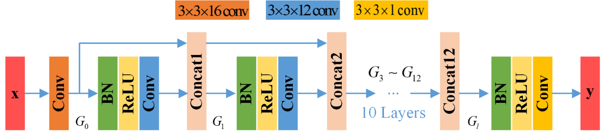
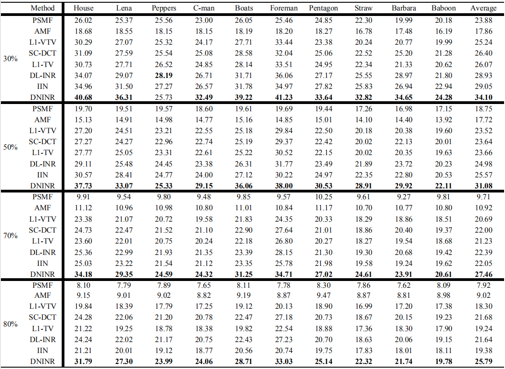
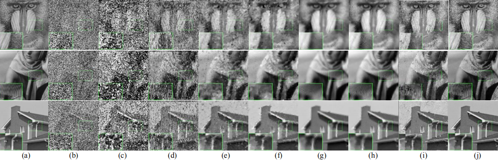

# DNINR
Densely connected network for impulse noise removal

This is a demo Code based on the method described in the following paper:   
Densely connected network for impulse noise removal, Pattern Analysis and Applications, 2020.  
Author: G. Li, X. Xu, M. Zhang, Q. Liu.      
https://link.springer.com/article/10.1007%2Fs10044-020-00871-y       
Version : 1.0   
The code and the algorithm are for non-comercial use only.   
Copyright 2020, Department of Electronic Information Engineering, Nanchang University.

## Network architecture of DNINR
   
All the convolution layers are denoted as “Conv”. Batch normalization layers are denoted as “BN”. Rectified linear units are denoted as “ReLU”. “3x3x12 conv” denotes the number of filters is set to be 12 and kernel size is 3x3.

 
## The Denoising Results
Average recovery performance PSNR on test images corrupted with 30%, 50%, 70%, 80%.  
   

 
Visual comparison at noise level P = 0.7. (a) Reference image, (b) Noisy image with the noise power P=70%, (c-j) Denoised results of PSMF, AMF, L1-VTV, L1-TV, SC-DCT, DL-INR, IIN and DNINR.

## Other Related Projects
  * Variable augmented neural network for decolorization and multi-exposure fusion [**[Paper]**](https://www.sciencedirect.com/science/article/abs/pii/S1566253517305298)   [**[Code]**](https://github.com/yqx7150/DecolorNet_FusionNet_code)   [**[Slide]**](https://github.com/yqx7150/EDAEPRec/tree/master/Slide)
    
  * VST-Net: Variance-stabilizing transformation inspired network for Poisson denoising [**[Paper]**](https://www.sciencedirect.com/science/article/pii/S1047320319301439)   [**[Code]**](https://github.com/yqx7150/VST-Net)
  
  * IFR-Net: Iterative Feature Refinement Network for Compressed Sensing MRI [**[Paper]**](https://ieeexplore.ieee.org/document/8918016)   [**[Code]**](https://github.com/yqx7150/IFR-Net-Code)
    
  * Iterative scheme-inspired network for impulse noise removal [**[Paper]**](https://link.springer.com/article/10.1007/s10044-018-0762-8)   [**[Code]**](https://github.com/yqx7150/IIN-Code)

  * A Comparative Study of CNN-based Super-resolution Methods in MRI Reconstruction and Its Beyond [**[Paper]**](https://sciencedirect.xilesou.top/science/article/abs/pii/S0923596519302358)   [**[Code]**](https://github.com/yqx7150/DCCN)

  * Progressively distribution-based Rician noise removal for magnetic resonance imaging [**[Paper]**](http://archive.ismrm.org/2018/0773.html)   [**[Code]**](https://github.com/yqx7150/RicianNet) 
